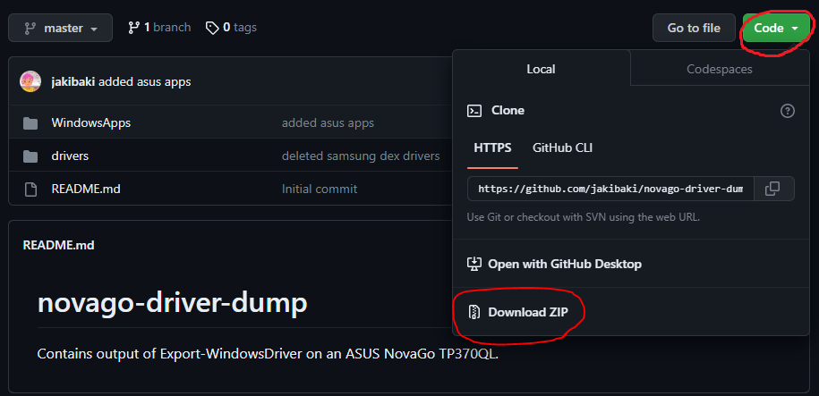
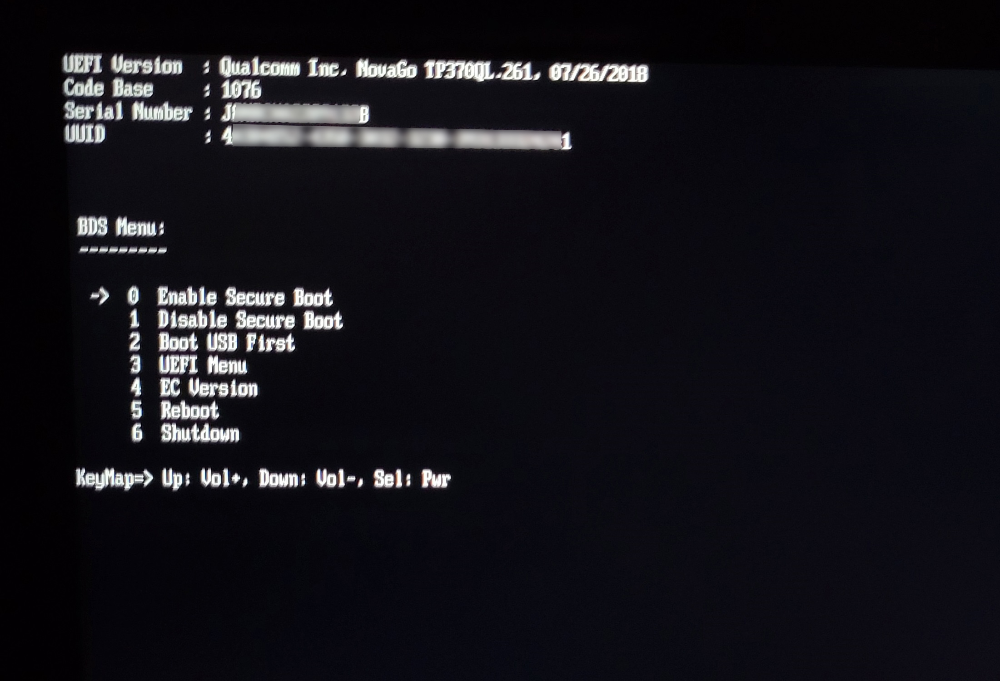

# :scroll: Disclaimer

    Please note that this tutorial is for informational purposes only, and the steps outlined may not be suitable for every device or situation.

    By using this tutorial, you understand and agree that you assume all risks associated with any actions taken on your device. The author of this tutorial, and the platform hosting it, disclaim any responsibility for any software or hardware damage that may occur as a result of following the instructions provided.

    Please proceed with caution, ensuring you have a clear understanding of the steps before implementing them. It is highly recommended to back up your important data and create a system restore point (if feasable) before attempting any recovery procedures.

    Performing modifications to your device, including recovery procedures, may void your warranty or violate manufacturer terms of service. Consult official documentation or seek manufacturer support for device-specific guidance.

    The information provided in this tutorial is based on the author's knowledge up to May 2023 and may not reflect the most up-to-date methods or best practices. Verify the accuracy and relevance of the information before proceeding.

    By utilizing the information in this tutorial, you agree to hold the author and the hosting platform harmless from any liability, including software/hardware damage, data loss, or other consequences arising from the use of this information.

    Proceeding with the tutorial indicates your acceptance of these terms and conditions. If you do not agree, please refrain from using the tutorial.

<br>

# :computer: ASUS NovaGo TP370QL Recovery 

I'm writing this tutorial just after fixing an ASUS NovaGo tablet PC and I think it will be useful to some of you as I saw a lot of people asking in forums, but nobody posting a real solution step by step (except for the user *_Gou* from Reddit who just defined which steps needs to be taken without going too much into details).

## :eyeglasses: Overview

The ASUS NovaGo TP370QL is a tablet PC with a Qualcomm Snapdragon CPU and an ARM64 architecture: the latter in particular makes it very hard to recover as most of todays desktop applications run in x86 and x64 architectures (ARM is mainly used in fully mobile devices instead).

This is the main reason why, by trying to install Windows 10 via its standard installation media, it won't even boot.

To overcome it, there are a few steps which can be followed:

1. [:arrow_down_small: Download Windows 10 ARM64 ISO](#download-windows-10-arm64-iso)
2. [:arrow_down_small: Download Asus NovaGo OEM drivers](#download-asus-novago-oem-drivers)
3. [:syringe: Edit the downloaded ISO to include OEM drivers](#edit-the-downloaded-iso-to-include-oem-drivers)
5. [:hammer: Rebuild the ISO File](#rebuild-the-iso-file)
6. [:trident: Make a bootable USB drive](#make-a-bootable-usb-drive)
7. [:construction: Setup ASUS NovaGo BIOS](#setup-asus-novago-bios)
8. [:trophy: Install Windows](#install-windows)

## :arrow_down_small: Download Windows 10 ARM64 ISO

**Microsoft does not officially provide an ISO for such version of its OS**, so it must be found somewhere else. Here are a few options:

- Download a [prebuilt Windows 10 20H1 ARM64 AIO UUP ISO](https://archive.org/details/19041.1.191206-1406.-vb-release-clientmulti-a-64-fre-en-us) from InternetArchive (**that's the one I went for**)
- Find and build a specific version on [uupdump.net](https://uupdump.net/)

**The first one** has been gently uploaded by the user *angryman03* explicitly for sharing with others; it's not the latest version indeed but it contains all the OS editions (Home, Pro, etc) and **its ready to be used**.

**The second option** is a website which collects a huge number of links to official Microsoft updates servers, but not all of them are still valid, so **it might be difficult to find what you are looking for**. <br> Furthermore, **there's no direct ISO download**, but the website asks you to **download a script which collects data from different sources and merge them** together in order to make an ISO file.

> If you are looking for a Windows 11 installer, a specific version of Windows 10 or anything similar, this is the right link, but I won't cover the usage of the provided script in this guide.

## :arrow_down_small: Download Asus NovaGo OEM drivers

Here I must make a **HUGE THANKS** to GitHub user [@jakibaki](https://github.com/jakibaki) because she created a [repo](https://github.com/jakibaki/novago-driver-dump) containing, literally, "*the output of Export-WindowsDriver on an ASUS NovaGo TP370QL*".

**Without those files there would be no way to generate an ISO which can boot on that machine** (except if you know where to find the one originally made by Asus :grin:).

So, the only thing to be done here is to [**download the full repository as a ZIP**](https://github.com/jakibaki/novago-driver-dump/archive/refs/heads/master.zip) and extract it wherever you like, i.e. in "*C:\NovaGo_drivers*" (you can also clone the repo instead, it's up to you).



## :syringe: Edit the downloaded ISO to include OEM drivers

This step is deeply covered by [this tutorial on tenforums.com](https://www.tenforums.com/tutorials/95008-dism-add-remove-drivers-offline-image.html), but I'll still write here an essential guide on which steps I did to get what I needed:

1. Open the ISO previously downloaded
2. Copy the content into a temporary folder (let's say "*C:\ISO_Files*")
3. Open PowerShell with administrator rights
4. Run the command 
    ```powershell
    Dism /Get-WimInfo /WimFile:C:\ISO_Files\Sources\install.wim
    ```
    This command will show you all the Windows editions included in the ISO.<br>
    Find the one you need (I went for the "*Windows 10 Professional*" edition) and take note of the Index (in my case was 2)
5. Go to *C:* drive root and create a folder named "*Mount*"
6. Run the commands
    ```powershell
    Dism /Mount-Image /ImageFile:C:\ISO_Files\Sources\install.wim /Index:2 /MountDir:C:\Mount

    Dism /Mount-Image /ImageFile:C:\ISO_Files\Sources\boot.wim /Index:2 /MountDir:C:\Mount
    ``` 
    *(In these commands you must replace the "**/Index:2**" with the index you took note in step 4)*
    
    Such commands will mount the contents of the *install.wim* and *boot.wim* images in the specified folder, making them accessible and editable by the DISM tool.
7. Run the command
    ```powershell
    dism /Image:C:\Mount /Add-Driver /Driver:C:\NovaGo_drivers\drivers /Recurse
    ```

    This command will inject the ASUS NovaGo drivers listed in the "*drivers*" subfolder into the mounted images.
8. Finally, run this command to commit (save) the changes made till now:
    ```powershell
    dism /Unmount-Image /MountDir:C:\Mount /Commit
    ```

## :hammer: Rebuild the ISO File

**Now** that the "*ISO_Files*" folder contents have been changed, **we need to rebuild the ISO itself**; to do so, I used the **OSCDIMG** tool from Microsoft (as stated in *Part Five* of [this other guide from tenforums.com](https://www.tenforums.com/tutorials/72031-create-windows-10-iso-image-existing-installation.html)).

If you don't have it installed already (and you probably don't), you need to get it from one of these installers:
    
* [Windows Assessment and Deployment Kit (ADK) for Windows 10](https://developer.microsoft.com/en-us/windows/hardware/windows-assessment-deployment-kit) (for systems not opted in to Insider builds - **I installed the "*Windows ADK for Windows 10, version 2004*" one from that link**)
* [Windows Insider Preview ADK](https://www.microsoft.com/en-us/software-download/windowsinsiderpreviewADK) (for pre-release Windows Insider build)

During the installation select the "*Deployment tools*" component only (it's about 90mb) and complete it.


Now follow these steps:

1. Open **with administrator rights**:

    **Start menu --> Windows Kits --> Deployment and Imaging Tools**
2. Run this command:
    ```BatchFile
    oscdimg.exe -m -o -u2 -udfver102 -bootdata:2#p0,e,bc:\iso_files\boot\etfsboot.com#pEF,e,bc:\iso_files\efi\microsoft\boot\efisys.bin c:\iso_files c:\Win10_ARM64.iso
    ```

When the process will end, it will create the "*Win10_ARM64.iso*" file in the root of the *C:* drive: this is the ISO image we are going to use on the next step to make a bootable USB.

## :trident: Make a bootable USB drive

There are plenty of ways to do this operation, so I'll write down the one I used (and that I actually prefer) just to give an example.

Download [Rufus](https://rufus.ie/en/#) and run it, then:
* Insert a USB drive to write the ISO on it (**NOTE: it will be formatted at the end of this process!**)
* From the "*Device*" dropdown list, select the drive you just inserted
* Click on the "*SELECT*" button and select the ISO created during the previous step
* The other options should be automatically filled in the correct way (but I'll still leave here a screenshot for reference)

    

## :construction: Setup ASUS NovaGo BIOS

In order to be able to boot the pen drive prepared in the previous step, the ASUS NovaGo BIOS must be configured accordingly, so:

* Turn on the device **by keeping the POWER and the VOLUME UP buttons pressed together**, until the BIOS setup screen is reached (see picture below)

    

* Press **1 followed by the POWER button** to enter in the "*Disable Secure Boot*" section
* Press **VOLUME UP** to confirm
* Press it another time to go back to the main menu
* Press **2 followed by the POWER button** to enter in the "*Boot USB First*" section
* Press **VOLUME UP** to enable it
* Press it another time to go back to the main menu
* Press **6 followed by the POWER button** to shut down the device

## :trophy: Install Windows

Here's the final step: just **put the USB drive you prepared into the PC and turn it on**.

**If everything has been done correctly, Windows installation should start** and you should be able to install Windows 10 (or any version you choose) on the PC.

OEM drivers are already included in the ISO, so no further operation is required, only installation.

<br>

# :100: Conclusion

Armed with the knowledge and steps outlined in this guide, you now know how to effectively troubleshoot and fix a Windows installation on an ASUS NovaGo laptop.

I seriously hope this guide helped you, especially because I put a lot of effort in writing it!

<br>

# :muscle: Support my work

If this guide saved your device from the trash can, please consider [buying me a coffee](https://paypal.me/jackdan93) :coffee: